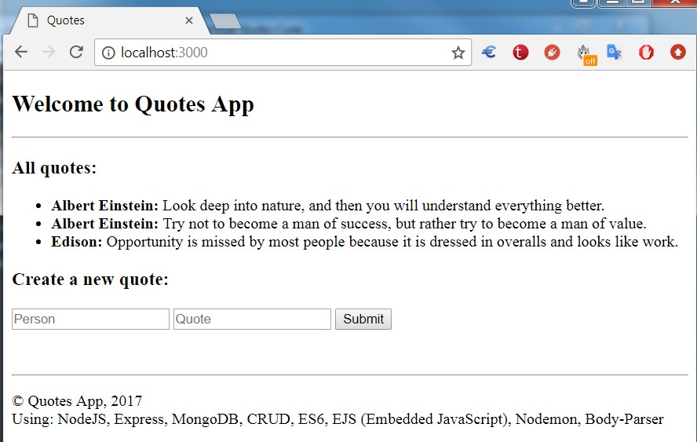

# Quotes (Web App)

Educational, simple CRUD application with Express and MongoDB.

#### Using:  
- JavaScript ES6, NodeJS, Express, MongoDB, Mongo Atlas, CRUD 
- EJS (Embedded JavaScript), Nodemon, Body-Parser

#### Screenshot of app:  
<h1>
    
</h1>
     
#### To Run this app:

Go to Mongo Atlas website and deploy a DB with a collection named `quotes`.  
In `server.js`, put your MongoDB connection string URL into `MONGO_URL`.

````
git clone ...
npm install express --save
npm install nodemon --save-dev
npm install body-parser --save
npm install mongodb --save
npm install ejs --save
npm start
````


#### Todos:
  - Add Update/Edit and Delete quotes features
    
#### Note/References:  
- This project is slightly modified, refactored and ES6 version of https://zellwk.com/blog/crud-express-mongodb/.


